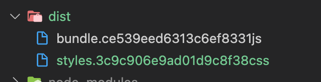
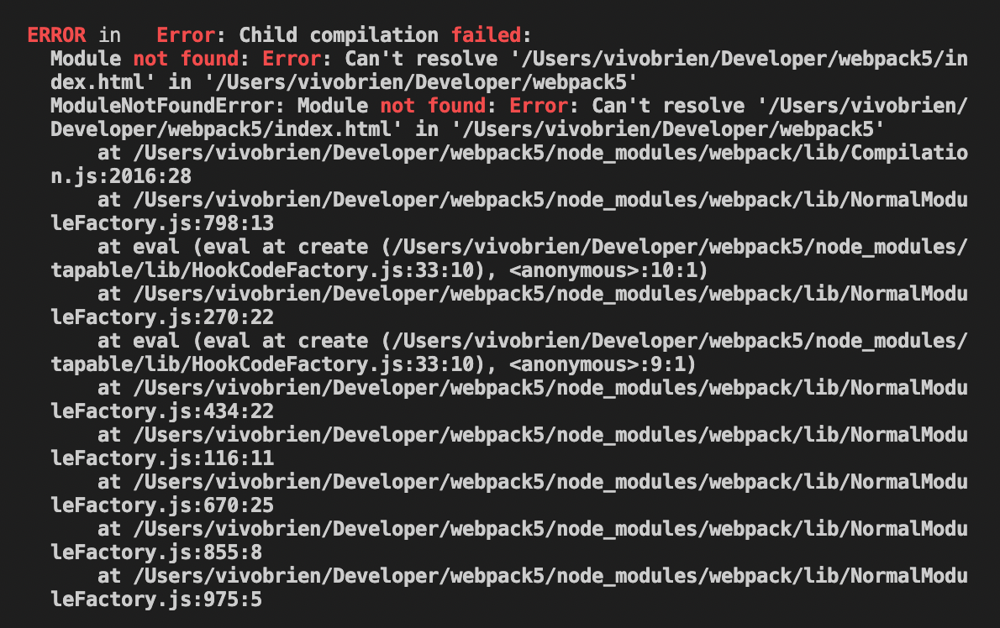
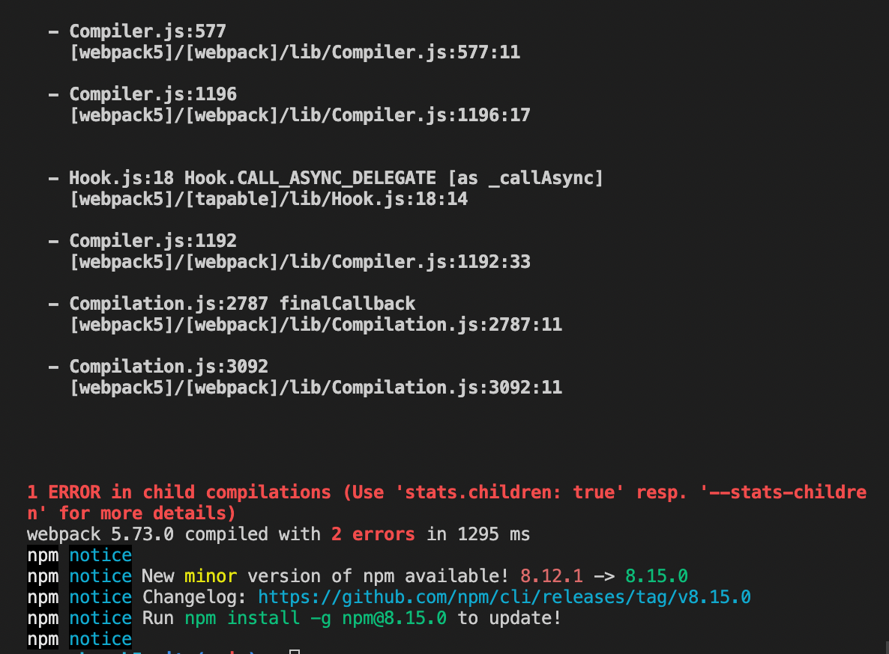

<div style="text-align:center">

</div>

# Learning about Webpack5 :grin:

## Table of Contents

1. [Asset Modules](#asset-modules) :atom:
2. [Loaders](#loaders) :cd:
3. [Webpack Plugins](#webpack-plugins) :electric_plug:
4. [Production versus Development Builds](#prod-versus-dev-builds) :bricks:
5. [Multiple Page Applications](#multiple-page-applications) :books:
6. [Module Federation](#module-federation) :atom_symbol:

### Asset Modules <a name="asset-modules"></a> :atom:

**asset/resource**: Generates a new file output for every file in the output directory for each of your assets and exports the url to that file. Use this one when importing large files

**asset/inline**: Generates a base64 representation of your assets and injects that base64 string into your main Javsacript bundle. Use this one when importing small files.

**asset**: Allows webpack to make this decision based on the size of each file. If the file size is less than 8 kilobytes then this file will be treated as an inline asset and if the file size is above then it will be treated as an asset/resource

### Loaders <a name="loaders"></a> :cd:

- Allows you to import any other type of files that you cant handle using asset modules. Webpack was designed to help you bundle all your dependencies into one or more files.
- What kind of dependencies are we talking about? Usually dependencies are other JS modules that your main JS file requires in order to do its job. But we can do so much more than that! With webpack, we can import css files right into your javascript code (you can import sass, less, xml etc).
- Loaders are js libraries that help you import all that stuff. When using asset modules we didnt have to use any additional npm packages because webpack includes asset modules out of the box on the other hand when using loaders we need to install them **explicitly**.
- Every webpack loader comes as an npm package that you can add as a dependency to your applicationOne of the coolest features of webpack is the ability to import css files right into your js code.
- Babbel is the most popular javascript compiler. Created a rule for importing js file but excludes those in node modules folder. Told webpack to use babel loader for these files. Need to specify some extra options for babel loader. `babel env` ES6 + to ES5. **Converts new EcmaScript(6+) to older EcmaScript(5) which is supported by all browsers**. If you want to use class which is not supported by some major browsers then use `class-properties`.

### Webpack Plugins <a name="webpack-plugins"></a> :electric_plug:

- Plugins are additional javascript libraries that do everything loaders cannot do.
- Plugins can also modify how the bundle themselves are created. For example uglify/SPlugin takes the `bundle.js` and minimises the contents to decrease the bundle size.

Minification of the resulting webpack bundle


`const TerserPlugin = require("terser-webpack-plugin");`

` plugins: [new TerserPlugin()]`


#### Using `mini-css-extract-plugin`

Some time ago we learnt how to import css inside our js files we did this through css loader and style loader. We want two bundles instead of one. This will allow our js bundle to be alot smaller. We can load several files in parallel. The following code will extract our CSS into a separate files and we can even specify the name of this file. To do this, we need to replace our `"style.loader"` in `/\.css$/` and dont forget to import `const MiniCssExtractPlugins = require("mini-css-extract-plugin");` - dont forget to install this by `npm install mini-css-extract-plugin --save-dev` next do `plugins: [new MiniCssExtractPlugins({filename: styles.css})]` then once you run webpack you will see the styles.css file in your dist folder. Next make sure to include this in your `index.js` file ` <link rel="stylesheet" href="./dist/styles.css"/>`

#### Browser caching and how webpack can help us do that

- Every time you load a page, the browser downloads all its assets. This can make the website take a long time to load especially on mobile or if there are alot of assets. Customers will need to await several minutes until the page is ready. The solution to this problem is called browser caching. If the file doesnt change between page reloads then your browser can save it to a specific place known as **_cache_**.
- When you reopen this page the browser download this file again. It will take this file from cache. This technique helps save a lot of time and traffic. However this may lead to another issue. What if you fixed a bug on your website and your javascript file has been changed? If the browser always takes this file from cache, your customers will never get the new version.
- Therefore, we need a mechanism for updating the cache. One of the most popular approaches is creating a new file with a new name each time you make a change. Browsers remember files like names therefore if the name changes, browsers will download the new version. Note: it does not mean that we need to change the file name every time we change our code. Webpack can do this automatically. One of the best practices is to add MD5# to the name of the file. It will generate a new file name only if the filename has some change inside.
  `filename: "bundle.[contenthash]js"`. Now we have two bundles in the `'./dist'` folder.

  

  This sequence of MD5# stays the same if no files were changed but if changed the updates. If we were to add `let ten = 10;` to our `index.js` file then run webpack again and look at the difference we would get

    

Also needed for `filename: "styles.[contenthash]css"`

Now we will remove all the bundles from the dist folder before generating the new bundles. This is done using a plugin known as clean webpack plugin! Each time you run the build process clean, webpack plugin will clean the output dot path folder i.e. output.path is this folder `path: path.resolve(__dirname, "./dist")`
When we say clean everytime we run webpack it will simple remove all the old bundles from the bundle folder. Make sure to install by `npm install clean-webpack-plugin --save-dev`. './dist' folder after installing

   

It is possible to clean multiple folders using options in the plugins array.

You can use `clean-webpack-plugin` [clean-webpack-plugin](https://www.npmjs.com/package/clean-webpack-plugin)

```javascript
   new CleanWebpackPlugin({
     cleanOnceBeforeBuildPatterns: [
          "**/*", // remove all files together no matter how many nesting levels there are
          path.join(process.cwd(), "build/**/*"), // this removes everything from the build folder
       ],
   }),
```

or `output.clean` [output.clean](https://webpack.js.org/guides/output-management/#cleaning-up-the-dist-folder)
but only has two properties:

```javascript
output: {
    filename: "bundle.[contenthash]js",
    path: path.resolve(__dirname, "./dist"),
    publicPath: "dist/",
    clean: {
        dry: true,      // which to remove
        keep: /\.css/   // which to keep
     }
}
```

Page will not upload babel from index.js unless it is the same name as what is in the './dist' folder. We can not manually change the babel.base64code.js everytime. **_Webpack has a special plugin that updates the names of our bundles._** This plug in is called `html-webpack-plugin`. Install using `npm install html-webpack-plugin --save-dev`. All the options you can change using [html-webpack-plugin](https://webpack.js.org/plugins/html-webpack-plugin/). It allows you to change title, description, subfolder etc instead of `'./dist'`. In order for index.js to include `<script>` you need to include the following (all of these params are needed):

```javascript
new HtmlWebpackPlugin({
  filename: "index.html",
  template: "index.html",
  inject: true,
});
```

For some reason there was a bundle.js added to my global folder of this project. When I removed it the style.css base64 string started updating in my './dist' folder.

The next problem I face is that even though I changed `publicPath: "./dist"`to `publicPath: ""`, it does not update in my index.html in my `'./dist'` folder. And when I remove the index.html from my global folder, run webpack and then check the file, it causes multiple error and is unusable. When I copy the path from `'./dist'` it does not work but when I copy the global `index.html` path it does work but does not contain the css of my file. This is true despite `[contenthash]` working for css.

These are the errors that come up




All of a sudden my bundle base64 code is now not updating in my index.html global or local therefore my page is not loading

All options for [html-webpack-plugin](https://github.com/jantimon/html-webpack-plugin#options)

Here is a list of all [official webpack plugins](https://webpack.js.org/plugins/)

[Handlebars](https://handlebarsjs.com/) is a template engine for JS that allows you to separate the business logic from presentation. If you find yourself generating html inside your js then you probably need some sort of template. `hbs` is an extension for handlebar templates.

### Production Versus Development Builds <a name="prod-versus-dev-builds"></a> :bricks:

- Prod builds require different set up than development builds. In production we want our builds to be as fast as possible and our bundles to be as small as possible. In dev we wants as much information as possible like source maps etc. How do we make our webpack config serve both use cases?

**_ Mode _**
This means we do not want any built in optimisations: `mode: none`
The 3 possible values we can put here are `none`, `development` and `production`. Comparing mode and bundle. Developer mode uses source maps by default.

```javascript
if (process.env.NODE_ENV === "production") {
  console.log("Production mode");
} else if (process.env.NODE_ENV === "development") {
  console.log("Development mode");
}
```

You can then have different webpack files for different environments i.e.`webpack.production.config.js` and `webpack.dev.config.js`. Make sure you change `mode`. Remove `[contenthash]` because we dont need the browser caching, TerserPlugin for dev because we dont need to minimise our code during development. Code minification takes time, it makes sense to minify the files in production when we need to optimise the page load time in order to improve the customer experience. Due to the same reason we also dont need to extract all of our css into a separate file during the development phase. It is mostly needed for production so we can safely remove `MiniCssExtractPlugin` - use style.loader instead. In small apps you wont notice a difference but in large apps you will. Since there is now two configs, it should be possible to load them separately. We create two different scripts in our package.json.

npm webpack dev server

`npm install webpack-dev-server --save-dev`

We need to config options

```javascript
mode: 'development',
devServer: {
  port: 9000,
  static: {
    directory: path.resolve(__dirname, "./dist") // what should be served on that port
  },
  devMiddleware: {
    index: 'index.html', // file that should be used as an index file
    writeToDisk: true // by default webpack dev server generates files in memory and doesnt save them to dist, in this sitch dist is going to be empty even though the application is going to be available in the browser. this often causes **confusion**. Therefore we enable this option. Then webpack will explicitly write the generated files to the dist folder and you will be able to look at them if needed.
  }
},
```

Change npm script to point to webpack dev server from
`webpack --config webpack.dev.config.js` to `webpack serve --config webpack.dev.config.js --hot`

--hot enables hot modular replacement. It is a great feature provided by webpack-dev-server.

### Multiple Page Applciations <a name="multiple-page-applications"></a> :books:

Up until this point we have used webpack in order to take all our modules and put them together into a single bundle.js file. As a result this bundle contains all of our javascript code. This approach is widely used when makes single page applications. In some projects we need to have more than one html page. Especially if these pages are rendered on the server side. The most probably server sends different pages to the browser depending on the url that you write in the navigation bar. If you have two pages with same dependencies, we need to figure out how to handle this. We will learn how to split out js code into multiple bundles and create multiple html files for different pages of our website.

In order for more than one html page to be rendered you need to change the entry point in our webpack config file. This is done by changing `javascript entry: './src/index.js'` to

```javascript
entry: {
  'hello-world': './src/hello-world.js',
  'kiwi': './src/kiwi.js'
}
```

`[contenthash]` could name them differently but it would be nicer to be able to label them separately. We can tell webpack to use file names that we specified in our entry points. We just need to change `bundle.[contenthash].js` to `[name].[contenthash].js`. It is common to use **substitutions** such as name, content hash and ID in square brackets. You could use ID but we want a human readable name therefore we use name. You can also use multiple substitutions in the file name.

### Module Federation <a name="module-federation"></a> :atom_symbol:
