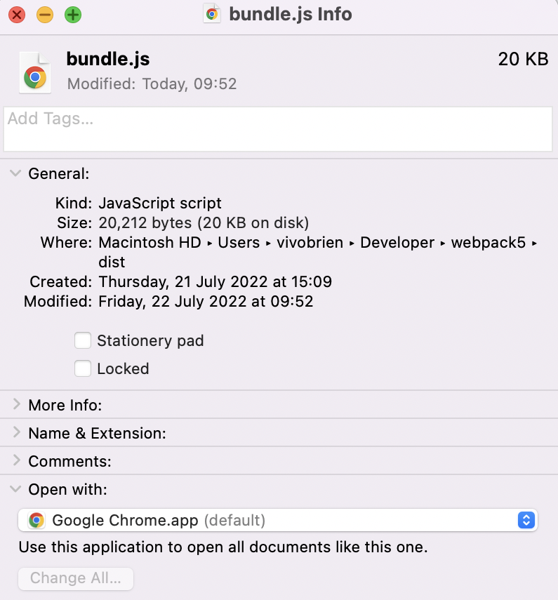
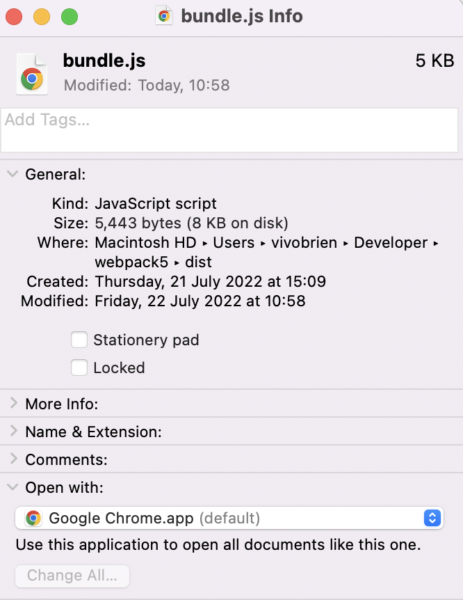
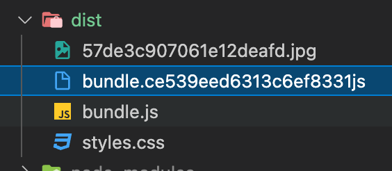
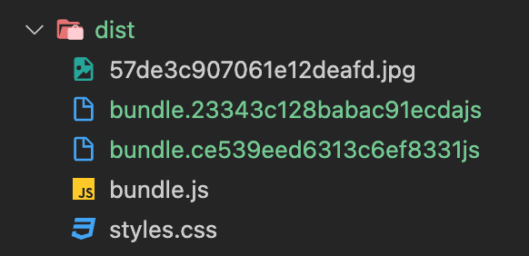

# Learning about Webpack5 :grin:

## Table of Contents

1. [Asset Modules](#asset-modules)
2. [Loaders](#loaders)
3. [Webpack Plugins](#webpack-plugins)

### Asset Modules  :atom:

**asset/resource**: Generates a new file output for every file in the output directory for each of your assets and exports the url to that file. Use this one when importing large files

**asset/inline**: Generates a base64 representation of your assets and injects that base64 string into your main Javsacript bundle. Use this one when importing small files.

**asset**: Allows webpack to make this decision based on the size of each file. If the file size is less than 8 kilobytes then this file will be treated as an inline asset and if the file size is above then it will be treated as an asset/resource

### Loaders  :cd:

- Allows you to import any other type of files that you cant handle using asset modules. Webpack was designed to help you bundle all your dependencies into one or more files.
- What kind of dependencies are we talking about? Usually dependencies are other JS modules that your main JS file requires in order to do its job. But we can do so much more than that! With webpack, we can import css files right into your javascript code (you can import sass, less, xml etc).
- Loaders are js libraries that help you import all that stuff. When using asset modules we didnt have to use any additional npm packages because webpack includes asset modules out of the box on the other hand when using loaders we need to install them **explicitly**.
- Every webpack loader comes as an npm package that you can add as a dependency to your applicationOne of the coolest features of webpack is the ability to import css files right into your js code.
- Babbel is the most popular javascript compiler. Created a rule for importing js file but excludes those in node modules folder. Told webpack to use babel loader for these files. Need to specify some extra options for babel loader. `babel env` ES6 + to ES5. **Converts new EcmaScript(6+) to older EcmaScript(5) which is supported by all browsers**. If you want to use class which is not supported by some major browsers then use `class-properties`.

### Webpack Plugins  :electric_plug:

- Plugins are additional javascript libraries that do everything a loaders cannot do.
- Plugins can also modify how the bundle themselves are created. For example uglify/SPlugin takes the bundle.js and minimises the contents to decrease the bundle size

Minification of the resulting webpack bundle

`const TerserPlugin = require("terser-webpack-plugin");`

` plugins: [new TerserPlugin()]`

#### Using `mini-css-extract-plugin`

Some time ago we learnt how to import css inside our js files we did this through css loader and style loader. We want two bundles instead of one. This will allow our js bundle to be alot smaller. We can load several files in parallel. The following code will extract our CSS into a separate files and we can even specify the name of this file. To do this, we need to replace our `"style.loader"` in `/\.css$/` and dont forget to import `const MiniCssExtractPlugins = require("mini-css-extract-plugin");` - dont forget to install this by `npm install mini-css-extract-plugin --save-dev` next do `plugins: [new MiniCssExtractPlugins({filename: styles.css})]` then once you run webpack you will see the styles.css file in your dist folder. Next make sure to include this in your index.js file ` <link rel="stylesheet" href="./dist/styles.css"/>`

#### Browser caching and how webpack can help us do that

- Everytime you load a webpage you download all that webpages assets. Every time you load the page, the browser downloads all those assets. This can make the website take a long time to load especially on mobile or if there are alot of assets. Customers will need to await several minutes until the page is ready. The solution to this problem is called browser caching. If the file doesnt change between page reloads then your browser can save it to a specific place known as **_cache_**. When you reopen this page the browser download this file again. It will take this file from cache. This technique helps save a lot of time and traffic. However this may lead to another issue. What if you fixed a bug on your website and your javascript file has been changed? If the browser always takes this file from cache, your customers will never get the new version. Therefore, we need a mechanism for updating the cache. One of the most popular approaches is creating a new file with a new name each time you make a change. Browsers remember files like names therefore if the name changes, browsers will download the new version. Note: it does not mean that we need to change the file name every time we change our code. Webpack can do this automatically. One of the best practices is to add MD5# to the name of the file. It will generate a new file name only if the filename has some change inside.
  `filename: "bundle.[contenthash]js"`. Now we have two bundles in the `'./dist'` folder.

  

  This sequence of MD5# stays the same if no files were changed but if changed the updates. If we were to add `let ten = 10;` to our index.js file then run webpack again and look at the difference we would get

    

Also needed for `filename: "styles.[contenthash]css"`
